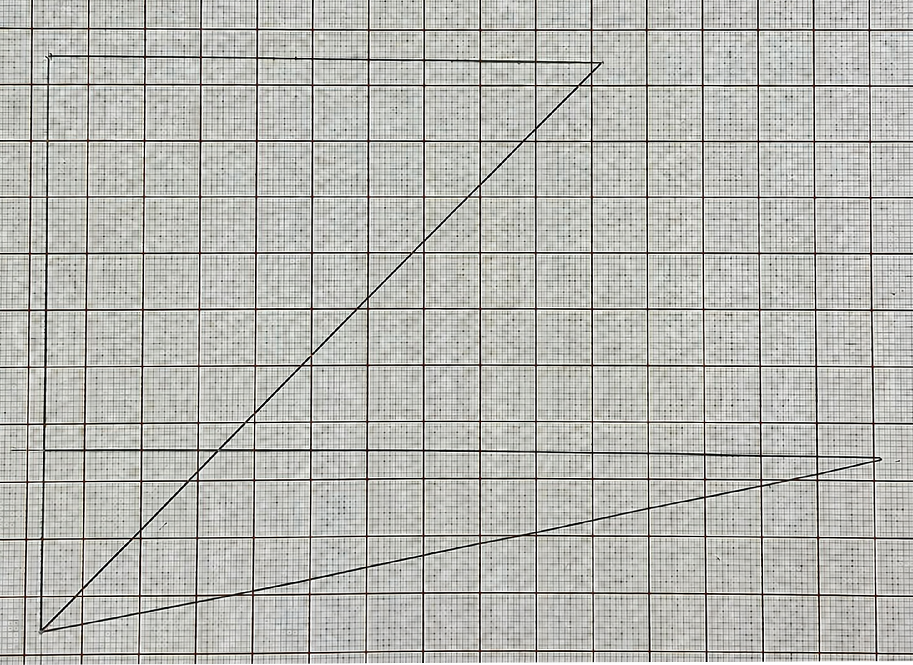
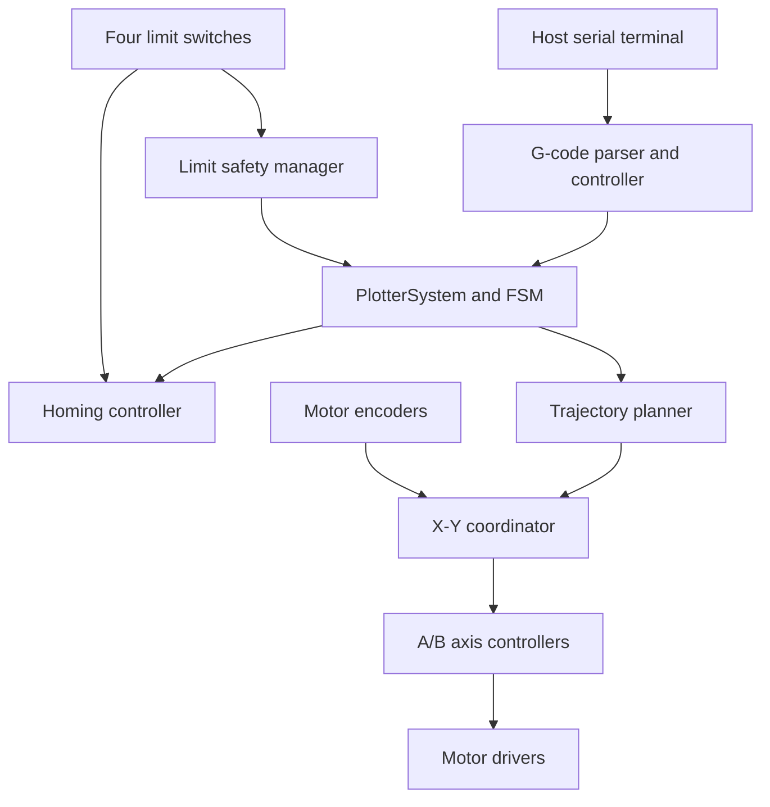

# Closed-Loop X-Y Plotter

An Arduino-based two-axis plotter with coordinated closed-loop motion, automatic homing, G-code
control, telemetry, and fault-tolerant limit handling.

> **Project context:** This was developed as a **four-person university course project** for
> **MECHENG 306 - Design of Sensing and Actuating Systems** at the University of Auckland. The
> project required the team to build and tune the core control, sensing, trajectory, parsing, and
> safety functions rather than relying on ready-made libraries.

## Overview

The system controls a coupled-belt X-Y mechanism driven by two DC motors with encoder feedback. A
host computer sends commands over USB serial, and the firmware converts Cartesian motion into
coupled motor references, generates a smooth trajectory, closes the position loop on both motors,
and monitors four mechanical limits.

The final firmware is structured as a set of small, testable modules rather than a single Arduino
sketch. All time-dependent behaviour is non-blocking, allowing serial input, encoder feedback,
motion control, homing, telemetry, and safety checks to run together in the main loop.

## Demo and Results

### Hardware demonstration

[▶ Watch the plotter running on the physical hardware (MP4, 1 min 31 s)](docs/assets/plotter-demo.mp4)

The demonstration shows the completed system executing coordinated closed-loop X-Y motion on the
physical plotter hardware.

### Drawing result



*Two triangular paths produced on graph paper during final system testing.*

### Core capabilities

- Coordinated straight-line X-Y motion from `G01` / `G1` commands
- Automatic two-axis `G28` homing with coarse and fine approach phases
- Custom PI position control with velocity feedforward and anti-windup behaviour
- Triangular and trapezoidal trajectory generation
- Pin-change-interrupt encoder counting with atomic count snapshots
- Active-high limit inputs with software debounce and interrupt verification
- Top-level `IDLE`, `HOMING`, `MOVING`, and `FAULT` state machine
- Unexpected-limit shutdown and recoverable `M999` fault reset policy
- Fixed-memory G-code parsing without dynamic allocation
- CSV telemetry for position, tracking error, PWM output, and integral state
- Compile-time absolute or relative G-code positioning mode

## Team Development

This was a collaborative four-person project. As a team, we divided the initial development into
hardware interfaces, control, motion planning, communication, and system-state tasks. We then
reviewed and integrated the modules into a single firmware architecture, tested the complete
machine, and refined the behaviour using measured hardware results.

Our shared development work included:

- Software architecture and integration across sensing, control, trajectory planning, G-code, homing, and safety modules
- Coordinated A/B motor control and Cartesian-to-motor conversion
- Limit-switch safety behaviour, FAULT handling, and `M999` recovery logic
- Homing-sequence refinement and unexpected-switch handling
- PI controller tuning, endpoint compensation, telemetry, and travel calibration
- Hardware/software fault isolation during system bring-up
- Git-based collaboration, code review, and final system integration

## Hardware

- Arduino Mega 2560
- Two DC motors with integrated quadrature encoders
- DFRobot L298-series dual motor driver/shield
- Four mechanical limit switches: left, right, bottom, and top
- Coupled-belt X-Y plotter chassis
- USB serial connection to a host computer

## System Architecture



The main application owns the hardware objects and enforces a deliberate update order:

1. Consume interrupt-latched limit events.
2. Route limits to homing or normal-operation safety handling.
3. Process serial commands.
4. Update the motion system and FSM.
5. Load soft limits after successful homing.
6. Emit telemetry and report state changes.

## Motion and Control

### Coupled-axis kinematics

Cartesian X-Y motion is converted into motor-space A/B motion using:

```text
A = X + Y
B = X - Y

X = (A + B) / 2
Y = (A - B) / 2
```

`Converter` applies the measured millimetres-per-count scale and the configured sign of each motor.
`XYCoordinator` captures one atomic encoder-count pair at the start of a move, converts each
Cartesian trajectory sample into absolute A/B references, and updates both motor controllers using
the same encoder snapshot and timestep.

### Trajectory generation

`TrajectoryPlanner` generates a straight-line path with either:

- A **trapezoidal profile** when the move is long enough to reach the requested feedrate, or
- A **triangular profile** when the move must begin decelerating before reaching that feedrate.

The planner outputs Cartesian displacement, Cartesian velocity, completion state, and remaining
path fraction. This lets the control layer reduce static-friction compensation near the target
without changing the geometric path.

### Position control

Each motor-space axis uses a custom PI controller with velocity feedforward:

```text
output = Kp * positionError + integralOutput + Kv * referenceVelocity
```

Additional endpoint behaviour was introduced to handle the real mechanism:

- Base PWM compensates for motor and carriage static friction.
- Base PWM tapers as the trajectory approaches the destination.
- A minimum endpoint PWM keeps small corrective commands physically effective.
- Reverse correction is limited to avoid aggressive oscillation.
- Direction-aware integral blocking and bleed reduce stale integral near the target.
- Conditional integration prevents further windup when the requested output is saturated.

The control period is configured at 5 ms, while the trajectory timing uses the measured elapsed time from `micros()`.

## Homing and Safety

### Homing sequence

The non-blocking homing controller finds X origin first and then Y origin. Each axis follows:

1. Coarse approach toward the origin switch
2. Contact pause
3. Encoder-measured backoff
4. Fine approach
5. Fine-contact pause
6. Controlled release

After both origin boundaries have been found and released, the mechanism performs a final X/Y
clearance move into the usable workspace before defining machine zero. The opposite-end switches
remain active safety inputs throughout homing. Encoder-derived cross-axis error can also trim the
two motor commands to keep single-axis homing motion straight.

### Limit and fault recovery

Outside homing, `LimitSafetyManager` combines interrupt-latched edges with debounced switch states.
An unexpected limit stops motion and reports an `UNEXPECTED_LIMIT` fault through the normal FSM
path.

The recovery design distinguishes between:

- A switch that is unexpectedly pressed,
- A pressed switch that is physically consistent with the carriage being at that boundary, and
- A switch that is temporarily expected after homing or an accepted `M999` reset.

Expected switches remain exempt only until they are released. Once released, they immediately
return to normal safety monitoring. Machine zero and existing soft limits are preserved across a
recoverable FAULT/M999 cycle.

## G-code and Console Interface

Serial settings:

```text
Baud rate: 115200
Line ending: CR, LF, or CRLF
```

Supported commands:

| Command | Purpose |
| --- | --- |
| `G28` | Start the complete X/Y homing sequence |
| `G01 X... Y... F...` | Execute a coordinated linear move |
| `M999` | Request recovery from the FAULT state |
| `STATUS` | Print state, limits, encoder counts, and Cartesian position |
| `!` | Immediate emergency stop |
| `X`, `STOP`, `M112` | Line-based emergency-stop alternatives |

Example using the current relative-position configuration:

```gcode
G28
G01 X100 Y0 F600
G01 X0 Y50 F600
G01 X-100 Y-50 F600
```

The parser validates missing values, duplicate parameters, malformed numbers, feedrate state,
positioning limits, and unsupported commands. Feedrates above the configured maximum are safely
limited rather than rejected.

## Telemetry

During a move, the firmware emits one CSV sample every 20 ms:

```text
time_ms,
reference_x_mm,actual_x_mm,error_x_mm,
reference_y_mm,actual_y_mm,error_y_mm,
error_a_counts,pwm_a,integral_a,
error_b_counts,pwm_b,integral_b
```

This telemetry was used to evaluate tracking, tune the PI and feedforward terms, identify endpoint
overshoot, and calibrate the effective drive diameter from measured travel.

## Engineering Challenges and Debugging

Some of the most valuable work occurred during hardware integration:

- **Intermittent encoder behaviour:** simultaneous counts appeared on both encoder channels when
  only one motor moved. Channel isolation and direct-wiring tests identified a faulty signal path
  on the supplied junction board rather than a software defect.
- **Coordinate and motor direction mapping:** empirical X/Y moves were used to separate Cartesian
  sign conventions, coupled-axis equations, encoder count signs, and electrical motor inversion.
- **Static friction near the endpoint:** a pure low-output PI correction could be mathematically
  valid but physically unable to move the carriage. Tapered base PWM and endpoint compensation
  were added to bridge that modelling gap.
- **Safe recovery at a pressed boundary:** simply clearing a fault would immediately re-trigger it,
  while globally ignoring the switch would be unsafe. The final expected-until-release mask
  provides a narrow, stateful exemption.
- **Mechanical calibration:** commanded travel was compared with measured travel, and the effective
  output diameter was adjusted to improve Cartesian distance accuracy.

These issues reinforced the importance of isolating hardware and software assumptions,
instrumenting the system, and validating each layer before tuning the full closed-loop machine.

## Repository Structure

```text
include/
├── app/              Top-level application composition
├── communication/    G-code data, parser, and system bridge
├── config/           Pin assignments and machine configuration
├── control/          PI control, kinematics, homing, and X-Y coordination
├── hardware/         Encoder, motor driver, and limit switch interfaces
└── system/           FSM, trajectory planning, and limit-safety policy

src/
├── app/
├── communication/
├── control/
├── hardware/
├── system/
└── main.cpp          Arduino entry points and encoder ISR vectors
```

## Building and Running

1. Select **Arduino Mega 2560** with the Arduino framework.
2. Add `include/` to the compiler include path and compile all files under `src/`.
3. Review `include/config/PinConfig.h` for the physical wiring.
4. Review and validate all values in `include/config/SystemConfig.h`, especially direction
   inversion, coordinate signs, travel limits, and homing PWM.
5. Connect a serial terminal at 115200 baud.
6. Power the mechanism with clear access to the emergency stop and verify low-speed directions
   before full-range operation.

The current application begins homing automatically at startup. Once homing completes and the fixed
travel values are loaded, the system accepts linear movement commands.

## Verification Approach

Development verification included:

- Host-side tests of Cartesian/A-B conversion
- Coordinated-reference and move-completion tests
- Parser tests for valid, malformed, inherited-feedrate, and out-of-range commands
- Bench tests of motor direction and encoder sign
- Individual limit-switch debounce and interrupt tests
- Homing tests for expected, contradictory, and unexpected switch activation
- Telemetry review of position error, PWM output, integral state, settling, and overshoot
- Measured-distance calibration using repeated Cartesian moves

## Skills Demonstrated

- Embedded C++ and Arduino/AVR development
- Real-time, non-blocking software architecture
- Feedback control and motion-profile generation
- Interrupt handling and atomic shared-data access
- Sensor debouncing and safety-state design
- Serial protocols and defensive parsing
- Hardware bring-up and systematic fault isolation
- Controller tuning, calibration, and telemetry-based validation
- Modular software integration and Git collaboration

## Academic Integrity

This repository is published as a portfolio and technical documentation of a university team
project. Current students should follow their institution's academic-integrity requirements and
should not copy this implementation for assessed work.
